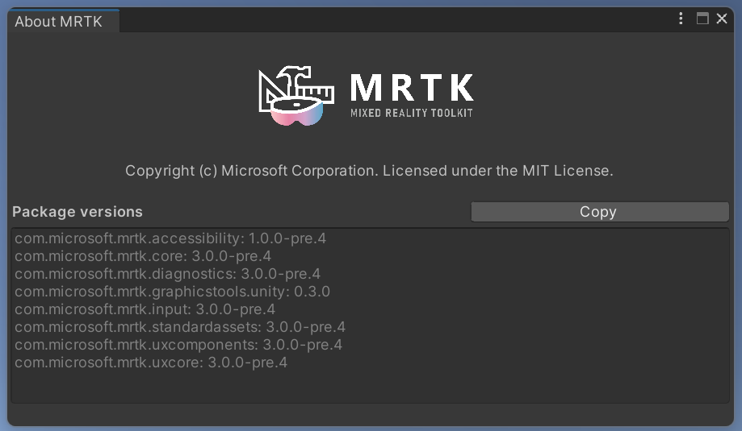

# What is MRTK3

MRTK3 is the third generation of the Microsoft Mixed Reality Toolkit for Unity. It is a Microsoft driven open source project to accelerate cross-platform mixed reality development in Unity. This new version is built on top of Unity's XR Management system and XR Interaction Toolkit.

## Software Requirements

To acquire and use MRTK3, the following software tools are required.

| Software | Version | Notes
| --- | --- | --- |
| [Microsoft Visual Studio](https://visualstudio.microsoft.com/) | 2019 Community edition or greater | Recommend Visual Studio 2022 |
| Unity | 2020.3, 2021.3 or newer | Recommend using an LTS release |
| [Mixed Reality Feature Tool for Unity](https://aka.ms/mrfeaturetool) | | Used to acquire MRTK3 packages |
| Mixed Reality OpenXR Plugin | | Install via Mixed Reality Feature Tool |

## Versioning

In previous versions of MRTK (HoloToolkit and MRTK v2), all packages were released as a complete set, marked with the same version number (ex: 2.8.0). Starting with MRTK3, each package will be individually versioned, following the [Semantic Versioning 2.0.0 specification](https://semver.org/spec/v2.0.0.html). 

>![NOTE]
>The '3' in MRTK3 is not a version number. It is an indicator of the generation of the underlying architecture, with HoloToolkit being generation one and MRTK v2.x being generation two.

Individual versioning will enable faster servicing while providing improved developer understanding of the magnitude of changes and reducing the number of packages needing to be updated to acquire the desired fix(es).

For example, if a non-breaking new feature is added to the UX core package, which contains the logic for user interface behavior the minor version number will increase (from 3.0.x to 3.1.0). Since the change is non-breaking, the UX components package, which depends upon UX core, is not required to be updated. 

As a result of this change, there is not a unified MRTK3 product version.

To help identify specific packages and their versions, MRTK3 provides an about dialog that lists the relevant packages included in the project. To access this dialog, select `Mixed Reality` > `MRTK3` > `About MRTK` from the Unity Editor menu.

# Branch Status

MRTK3 is currently in public preview and it is not recommended for use in production projects. We appreciate your testing, issues and feedback while the team works towards general availability (GA).

## Early preview packages

Some parts of MRTK3 are at earlier stages of the development process than others. Early preview packages can be identified in the Mixed Reality Feature Tool and Unity Package Manager by the `[Early Preview]` designation in their names.

As of June 2022, the following components are considered to be in early preview.

| Name | Package Name |
| --- | --- |
| Accessibility | com.microsoft.mrtk.accessibility |
| Data Binding and Theming | com.microsoft.mrtk.data |
| Environment | com.microsoft.mrtk.environment |
 
The MRTK team is fully committed to releasing this functionality. It is important to note that the packages may not contain the complete feature set that is planned to be released or they may undergo major, breaking architectural changes before release.

We very much encourage you to provide any and all feedback to help shape the final form of these early preview features.

# Roadmap

The roadmap from public preview to GA is detailed in the following table.

| Release | Timeline |
| --- | --- |
| Public Preview | June 8, 2022 |
| Preview updates | Approximately every 2-4 weeks until GA |
| General Availability | Fall / Winter 2022 |
